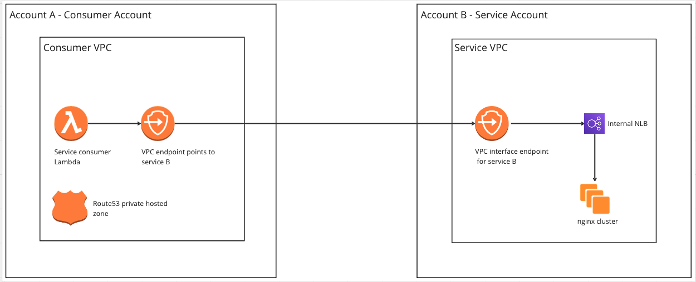
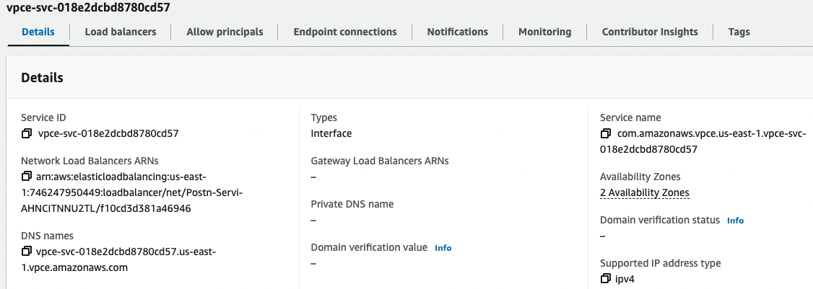
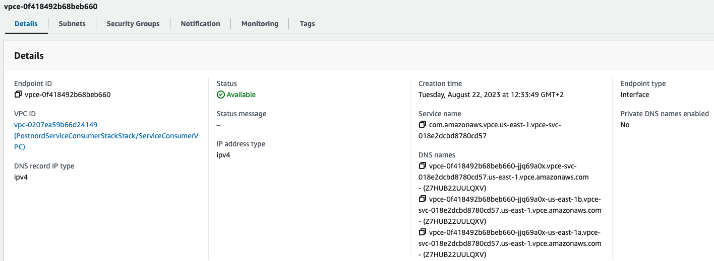
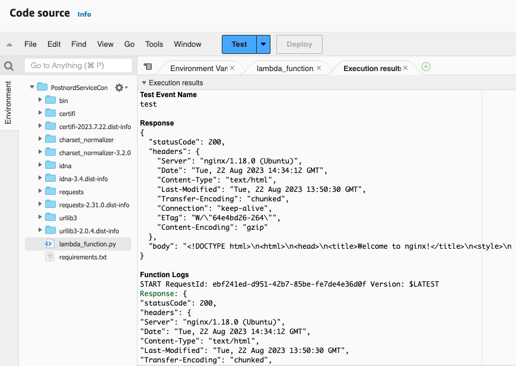

## PostNord Assignment - IaC Repo
This repo contains all the CDK configurations required to create the AWS infrastructure for the PostNord assignment. Below is the list of infrastructure components created under this project.

- On AWS account A (refer to as the Consumer Account)
    - VPC
    - VPC endpoint
    - Lambda function
    - Route53 private hosted zone
    - CNAME record

- On AWS account B (refer to as Service Account)
    - VPC
    - VPC interface endpoint
    - NLB

### Architecture Diagram

### Cross Account Connectivity
- A VPC Service Interface Endpoint was created at the Service account and linked to a NLB.

- At the Consumer account, an Interface Endpoint was created and linked to the service name of the VPC Service Interface Endpoint at the Service account.

### High Availability
- The NLB was deployed across 2 AZs
- The service app EC2 instances will be deployed across multiple AZs
- The lambda function was deployed across 2 AZs
- VPC Interface Endpoints are deployed across 2 AZs

### Lambda log outputs for successful connection establishment

### Testing
An initial test case has been generated in the Postnord-Service-Consumer-Stack -> test folder. It will evaluate the configuration parameters for Lambda, VPC and VPCEndpoint to make sure they are within the recommended range. A GitActions workflow is in place to run the test case and verify the results. 

#### Authors
Romesh Samarakoonn

