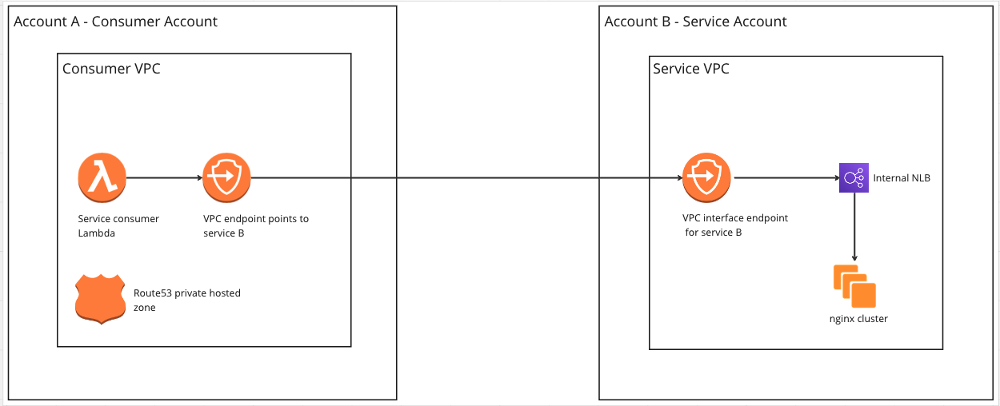
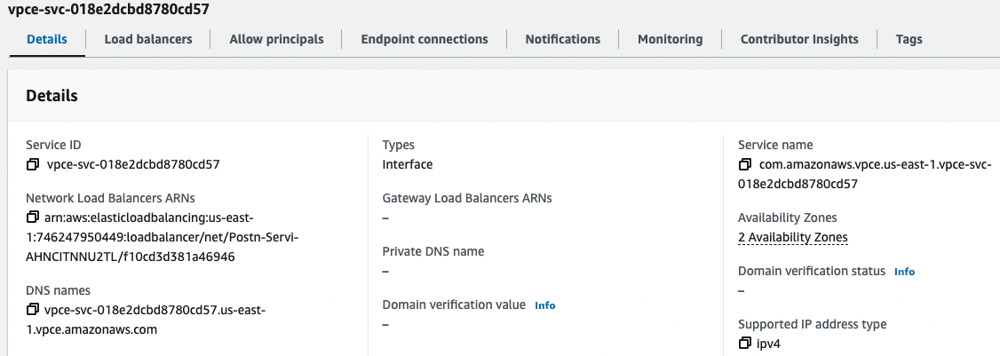
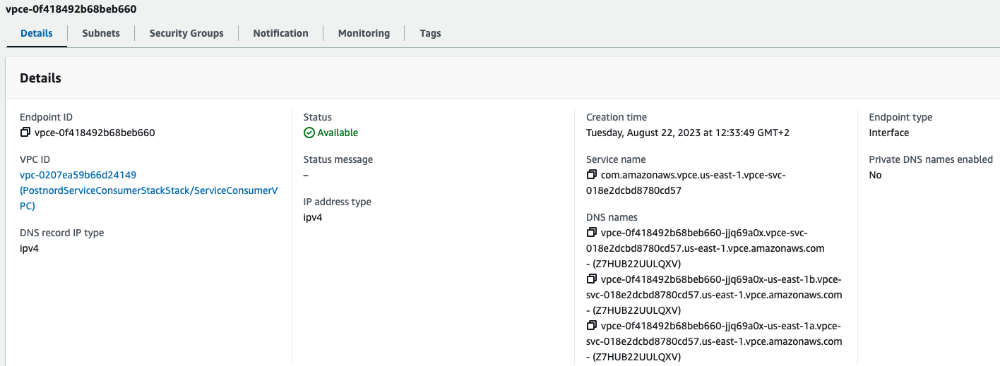

# PostNord Assignment - IaC Repo
This repo contains all the CDK configurations required to create the AWS infrastructure for the PostNord assignment. Below is the list of infrastructure components created under this project.

- On AWS account A (refer to as the Consumer Account)
    - VPC
    - VPC endpoint
    - Lambda function
    - Route53 private hosted zone
    - CNAME record

- On AWS account B (refer to as Service Account)
    - VPC
    - VPC interface endpoint
    - NLB

## Architecture Diagram

## Cross Account Connectivity
- A VPC Service Interface Endpoint was created at the Service account and linked to a NLB.

- At the Consumer account, an Interface Endpoint was created and linked to the service name of the VPC Service Interface Endpoint at the Service account.

## High Availability
- The NLB was deployed across 2 AZs
- The service app EC2 instances will be deployed across multiple AZs
- The lambda function was deployed across 2 AZs
- VPC Interface Endpoints are deployed across 2 AZs

## CICD

From a developer releasing a new version of the TRDL app to provisioning pods with the new version, all the steps are automated and managed by Flux. The Flux repository which contains the flux components as well as manifest files related to the pods, services and ingress can be found at https://github.com/thilan3547/fluxcd-demo-3.

## Future Improvements

- Migrate the Terraform state from local to S3 with DynamoDB checksum
- Use a user-friendly FQDN as the customer accessing URL
- Use HTTPS endpoint with an ACM certificate

### Authors

Romesh Samarakoon
